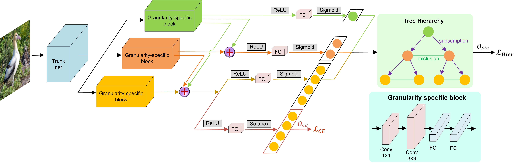
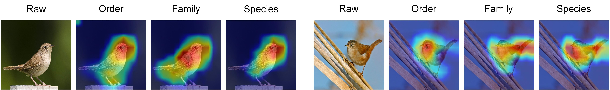

# HRN
Implementation for **Label Relation Graphs Enhanced Hierarchical Residual Network for Hierarchical Multi-Granularity Classification**

## Paper
This repo is a implementation for paper **Label Relation Graphs Enhanced Hierarchical Residual Network for Hierarchical Multi-Granularity Classification** that has been accepted by CVPR2022.

### [Preprint Version](https://arxiv.org/pdf/2201.03194v2.pdf)

### Network Architecture

### Visual Demonstration

HMC-LMLP

HMCN

C-HMCNN

Chang et al.

Ours

## Requirements
- Python 3.6+
- Pytorch 1.2+
- Torchvision 0.4+
- networkx 2.5
- CUDA 10.2

## Supporting Files for Datasets
- [CUB-200-2011](Datasets/CUB-200-2011)
- [Aircraft](Datasets/Aircraft)
- [Stanford Cars](Datasets/Stanford%20Cars)

## Code
### [CUB-200-2011 and Aircraft](CUB_Aircraft)

### [Stanford Cars](Stanford_Cars)